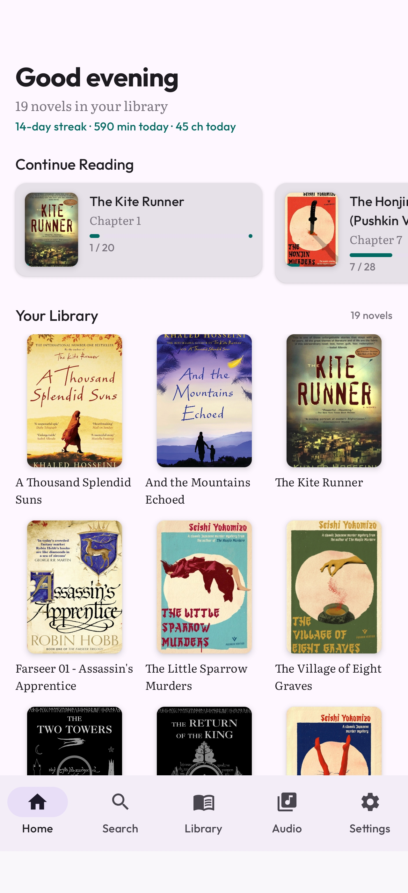
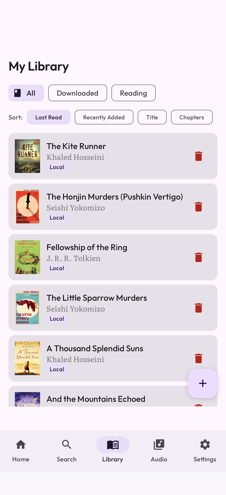
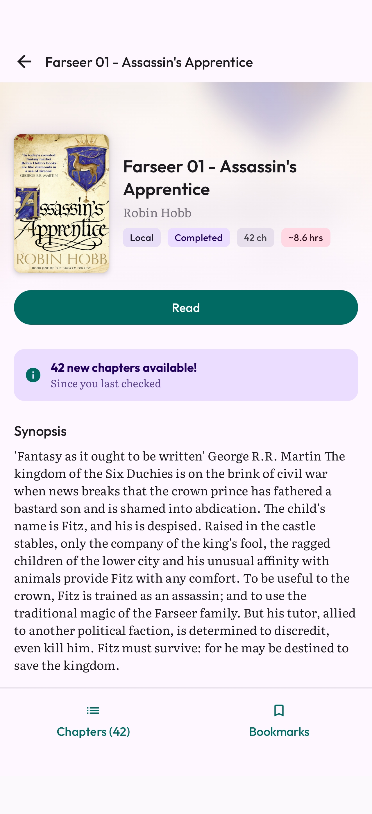
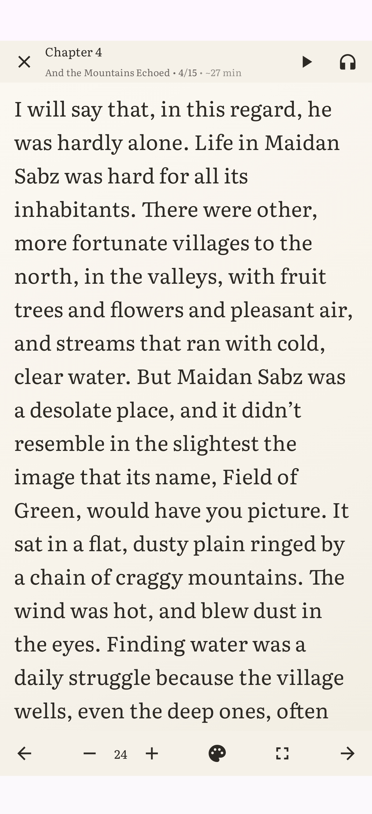
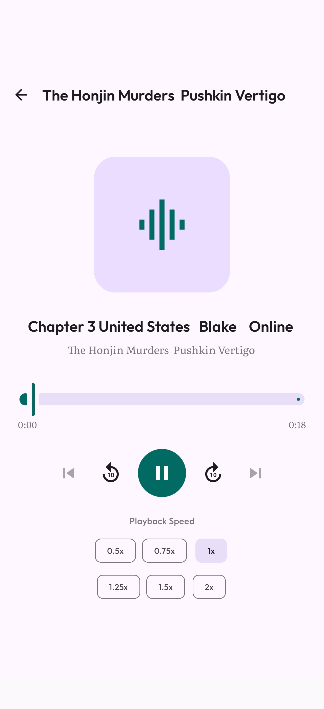
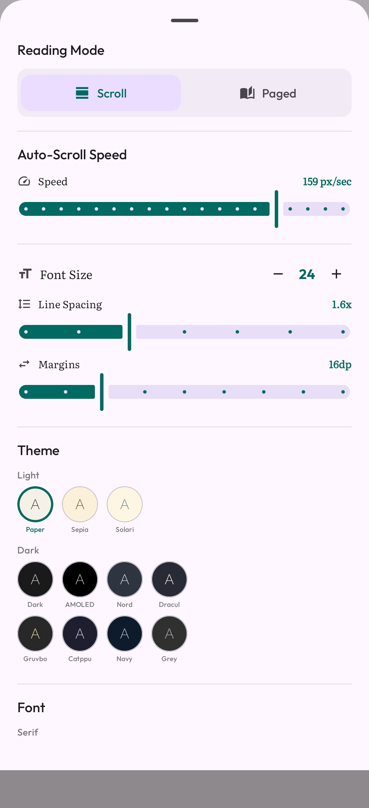

# NovelForge

A reading app for people who actually read.

NovelForge is a privacy-respecting Android reader for web novels and EPUBs. No account. No subscription. No analytics. The book stays on your phone — and now the app reads it too: a character codex, a relationship graph, and full-text search across your whole library, all computed on-device.

| Home | Library | Novel details | Reader | Audio | Quick settings |
| --- | --- | --- | --- | --- | --- |
|  |  |  |  |  |  |

## What it does

- Reads web novels from 7+ sources, with offline downloads
- Imports `.epub` files — and exports any novel back out as a clean EPUB
- **Character codex** — every recurring character, place, and faction indexed on-device, spoiler-safe: it only ever shows you what you've read
- **Relationship graph** — who appears with whom, drawn as a live map that grows with your reading position
- Full-text search across every downloaded chapter, plus in-chapter find with match highlighting
- 11 themes, 8 reading fonts, configurable margins and line spacing
- Scroll mode, paged mode, a teleprompter-style auto-scroll, and four tap-zone layouts
- Neural text-to-speech with Piper, Kokoro, and your device's TTS
- Generates M4B audiobooks with chapter markers
- Tracks reading stats locally (streaks, words, chapters, time)
- Bookmarks and highlights with notes, exportable as JSON
- Backup and restore as a single ZIP

[Full feature list →](docs/FEATURES.md)

## Install

[Download the latest APK from Releases](https://github.com/abhinavxt/novelforge/releases/latest).

Requires Android 8.0 (API 26) or later. Not on the Play Store.

```
1. Download the APK
2. Open it — Android asks once for install permission
3. Open the app
```

That's it. No account, no setup.

## Build from source

```bash
git clone https://github.com/abhinavxt/novelforge.git
cd novelforge
./gradlew assembleRelease
```

The signed APK lands in `app/build/outputs/apk/release/`.

Requirements: Android Studio Hedgehog or later, JDK 17, Android SDK 34.

## Stack

Kotlin · Jetpack Compose · Room (with FTS4) · Coroutines/Flow · WorkManager · Coil · Sherpa-ONNX

MVVM with a repository layer. See [`docs/FEATURES.md`](docs/FEATURES.md) for what each feature covers, and the source itself for how the layers connect.

## Contributing

Bug reports and feature suggestions go in [Issues](https://github.com/abhinavxt/novelforge/issues). Code contributions welcome — open a PR against `main`.

The project is built on weekends. Reviews aren't instant. Be patient.

## Disclaimer 

NovelForge does not own or have any affiliation with the books available through the app. All books are the property of their respective owners and are protected by copyright law. NovelForge is not responsible for any infringement of copyright or other intellectual property rights that may result from the use of the books available through the app. By using the app, you agree to use the books only for personal, non-commercial purposes and in compliance with all applicable laws and regulations.
NovelForge is a reading tool, not a piracy tool. It connects to publicly-accessible sites you'd otherwise visit in a browser, fetches the page, and renders it cleanly. No content is hosted by NovelForge.
If a site has a paid tier or Patreon, please support the author. Web novelists rely on it.

## License

[MIT](LICENSE) — do what you want with the code.

The novel content fetched by the app belongs to its authors. The MIT license covers NovelForge itself, not anything it reads.
