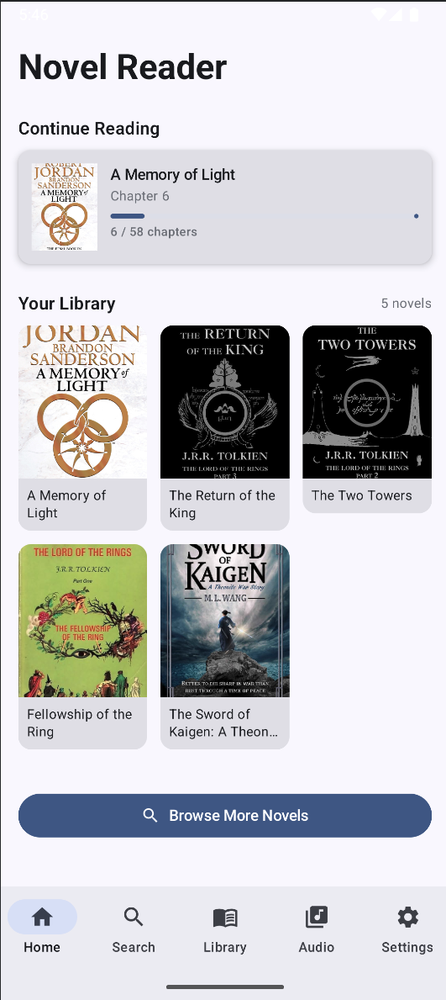
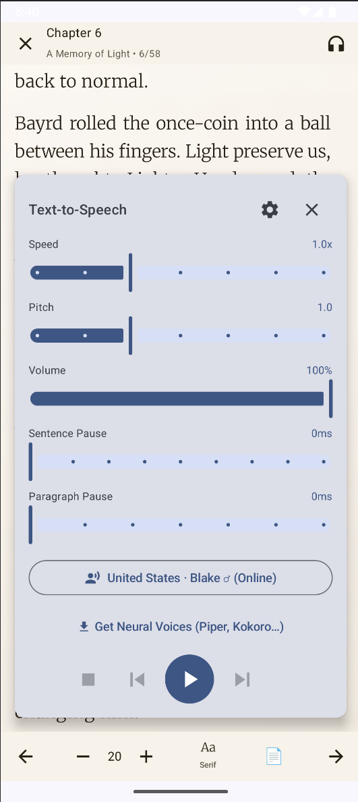
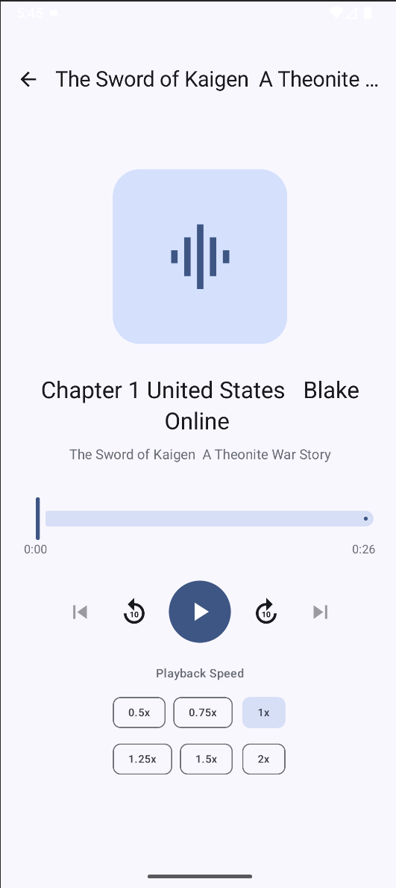

# Novel Reader

An Android app for reading web novels and EPUB files with neural text-to-speech, audio export, and offline reading. Kotlin, Jetpack Compose, MVVM.

<p align="center">
  
  
  
  
</p>

---

## What it does

You can read novels from EPUB files or from online sources, listen to them with neural TTS voices, and export chapters as audio files. The app tracks your reading position, lets you bookmark passages, and keeps working in the background while you do other things.

### Reading

- Open `.epub` files from local storage
- Browse, search, and download from 7 online sources (toggleable for Play Store builds)
- Per-chapter downloads with progress indicators
- Reading position saved and restored automatically
- Bookmarks across all novels
- Chapter search and jump-to-chapter
- Library filters: All, Downloaded, Currently Reading
- Offline mode indicators on chapter lists so you know what's available without a connection
- Dictionary lookup (English, Hindi, Japanese, Chinese, French, Spanish) via long-press

### Text-to-Speech

Two engines: Google TTS (system voices, ~24 English variants) and Sherpa-ONNX (offline neural voices via Piper, Kokoro, and KittenTTS). 67 voices across 24 languages total. Pick a voice from the unified selector and the app routes to the right engine.

Background playback works through a foreground service with MediaSession, so lock screen controls, earphones, and Bluetooth all work. The notification shows the novel title, chapter, sentence progress, and has play/pause/skip/stop buttons.

### Audio Export

Convert chapters to `.wav` files using whatever TTS voice you want. You can export one chapter, all chapters, or just the remaining ones. Exports run in the background with a progress notification (sentence X/Y). The same chapter can be exported with different voices and each export is tracked separately.

Output goes to `Music/NovelReader/{novel_name}/{chapter}_{voice}.wav`.

### Audio Player

Three screens: Audio Library (lists novels with exported audio) → Chapter List (chapters for that novel, with delete) → Player (seek bar, ±10s skip, speed from 0.5x to 2x, chapter navigation). Uses `MediaPlayer` under a shared ViewModel.

### Play Store Mode

`AppConfig.ONLINE_SOURCES_ENABLED` is a single flag that hides all online source UI (browse, search, download buttons). Flip it to `false` and the app ships as a pure EPUB reader without removing any code. Bottom nav, routes, and ViewModels all respect it.

---

## Project structure

```
com.abhinavxt.novelreader/
├── data/
│   ├── database/            # Room DB, DAOs, entities
│   ├── source/              # Novel source scrapers (7 sources + SourceManager)
│   ├── model/               # Data classes
│   ├── tts/                 # TTS engines, model manager, audio exporter
│   ├── TTSManager.kt        # Orchestrates Google + Sherpa engines
│   ├── DownloadManager.kt   # Chapter download logic
│   ├── BackupManager.kt     # Library backup/restore
│   ├── DictionaryRepository.kt
│   └── ThemePreferences.kt  # SharedPreferences-backed StateFlows for theme
├── service/
│   └── TTSForegroundService.kt  # MediaSession, notifications, background TTS
├── ui/
│   ├── screens/             # All screens (Home, Reader, Search, Settings, Audio, etc.)
│   ├── viewmodel/           # ViewModels for each screen
│   ├── components/          # Shared composables
│   └── Navigation.kt        # NavHost and route wiring
├── util/
│   ├── Logger.kt            # Use this instead of Log.d/Log.e
│   └── AppConfig.kt         # Feature flags
└── MainActivity.kt
```

The architecture is MVVM + Repository. ViewModels expose `StateFlow`, repositories sit on top of Room and network calls. Coroutines everywhere: `Dispatchers.IO` for file and database work, `Main` only where Android requires it (Google TTS `synthesizeToFile` needs a Looper).

---

## TTS internals

**TTSManager** delegates to whichever engine is active. One API for `speak()`, `stop()`, `getAvailableVoices()` regardless of engine.

**GoogleTTSEngine** wraps Android's `TextToSpeech`. Parses voice name strings like `en-us-x-sfg-local` to extract variant codes and map them to readable names (Aria, Luna, River, etc.).

**SherpaOnnxEngine** bridges to [Sherpa-ONNX](https://github.com/k2-fsa/sherpa-onnx) via JNI for offline neural TTS.

| Detail      | How it works                                                 |
| ----------- | ------------------------------------------------------------ |
| Threads     | `availableProcessors() / 2`, clamped 2-4                     |
| Audio       | `AudioTrack` in `MODE_STREAM`                                |
| Concurrency | `Mutex` around JNI calls                                     |
| Models      | `voices.bin` distinguishes Kokoro/KittenTTS from Piper       |
| Archives    | `resolveModelRoot()` handles nested dirs from extracted zips |
| JNI safety  | `Tts.kt` returns `Any` to avoid version mismatch crashes     |

**AudioExporter** streams PCM sentence-by-sentence to a temp file instead of accumulating floats in memory. A long chapter used to spike ~312 MB from one big `List<Float>`; now it stays flat. Exports run in their own `CoroutineScope(SupervisorJob())` so they survive ViewModel destruction.

---

## Online sources

Seven scrapers registered in `SourceManager`, each with a slug prefix for novel IDs:

| Source                 | Prefix | Notes                                    |
| ---------------------- | ------ | ---------------------------------------- |
| RoyalRoad              | `rr_`  | Default source                           |
| ReadNovelFull          | `rnf_` | AJAX chapter loading via `data-novel-id` |
| FreeWebNovel           | `fwn_` |                                          |
| LibRead                | `lr_`  |                                          |
| NovelFullNet           | `nfn_` |                                          |
| PawRead                | `pr_`  | `onclick` chapter navigation pattern     |
| Primordial Translation | `pt_`  | WordPress Flavor theme                   |

All scrapers use Jsoup + OkHttp with browser-like User-Agent headers.

---

## Setup

**You'll need:** Android Studio Ladybug (2024.2+), JDK 17, Android SDK 34 (min SDK 24).

```bash
git clone https://github.com/abhinavxt/novel-reader.git
cd novel-reader
# Open in Android Studio, sync Gradle, run on device/emulator
./gradlew installDebug
```

**Runtime permissions:** `READ_MEDIA_AUDIO` (scanning exported audio), `POST_NOTIFICATIONS` (TTS and export progress), `FOREGROUND_SERVICE` (background playback), `INTERNET` (online sources and model downloads).

---

## Logging

Everything uses `Logger` instead of `Log.d`/`Log.e`:

```kotlin
import com.abhinavxt.novelreader.util.Logger

Logger.d("TTSManager", "Voice switched to: $voiceName")
Logger.e("AudioExporter", "Export failed", exception)
```

Keeps log filtering in one place and makes it easy to plug in crash reporting later.

---

## Roadmap

- [ ] Pronunciation dictionary — custom word-to-phoneme mappings so TTS stops butchering character names
- [ ] Reading stats — track chapters read, time spent, streaks, words per day
- [ ] Bulk chapter download with queue management
- [ ] Scheduled auto-downloads for followed novels
- [ ] Chapter update checker with notifications
- [ ] Multi-voice character dialogue — assign different TTS voices to characters based on dialogue tags
- [ ] Ambient soundscapes — layer background audio (rain, battle, forest) during TTS playback
- [ ] Vocabulary builder — tap unfamiliar words to save them with context
- [ ] Novel-to-podcast export — RSS feed with chapters as episodes
- [ ] Google Play Store release (EPUB-only mode via feature flag)

---

## Tech stack

| Layer        | What                                         |
| ------------ | -------------------------------------------- |
| Language     | Kotlin                                       |
| UI           | Jetpack Compose, Material 3                  |
| Architecture | MVVM + Repository                            |
| Database     | Room                                         |
| Async        | Coroutines, StateFlow                        |
| TTS (system) | Android TextToSpeech API                     |
| TTS (neural) | Sherpa-ONNX (JNI) — Piper, Kokoro, KittenTTS |
| Audio        | MediaPlayer, AudioTrack                      |
| Background   | Foreground Service, MediaSession             |
| Navigation   | Jetpack Navigation Compose                   |
| Scraping     | Jsoup, OkHttp                                |

---

## License

MIT. See [LICENSE](LICENSE).

---

## Version history

| Version    | What changed                                                                                              |
| ---------- | --------------------------------------------------------------------------------------------------------- |
| **v1.6.0** | Primordial Translation source, offline mode indicators, dictionary lookup, 7 sources total                |
| **v1.5.0** | MediaSession for earphone/Bluetooth controls, rich TTS notifications, feature flag system, package rename |
| **v1.4.0** | Audio export pipeline, built-in audio player (3 screens), voice-specific export tracking                  |
| **v1.3.0** | 67 neural voices across 24 languages, Kokoro/KittenTTS support, batch look-ahead TTS                      |
| **v1.2.0** | Sherpa-ONNX integration, Piper neural voices, model download manager                                      |
| **v1.1.0** | Bookmarks, chapter search/jump, library filters, per-chapter download                                     |
| **v1.0.0** | Initial release — EPUB reading, online sources, Google TTS                                                |
