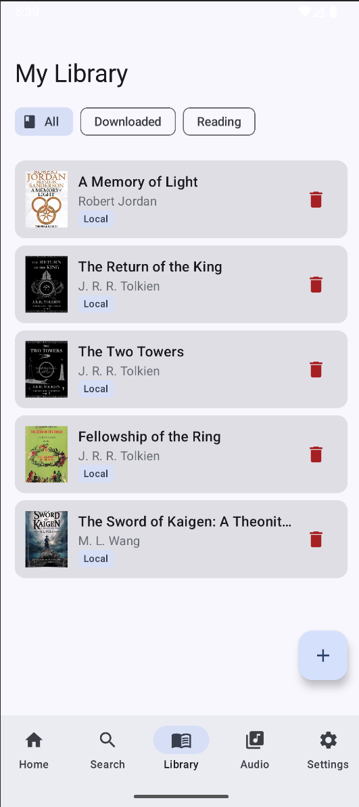

# Novel Reader

A feature-rich Android app for reading web novels and EPUB files with multi-engine neural text-to-speech, audio export, bookmarks, and chapter management. Built with Kotlin, Jetpack Compose, and a clean MVVM architecture.

<p align="center">
  
  
  
  
  
</p>

---

## Features

### Reading Experience

- **EPUB import** — Open and read `.epub` files from local storage
- **Online sources** — Browse, search, and download novels from the web (toggleable via feature flag)
- **Chapter management** — Per-chapter download with progress indicators, chapter search, and jump-to-chapter
- **Reading progress** — Automatically tracks your position per novel and restores it on relaunch
- **Bookmarks** — Save and revisit favorite passages across all your novels
- **Library filters** — Filter by All, Downloaded, or Currently Reading

### Multi-Engine Text-to-Speech

- **Google TTS** — System voices with ~24 named English variants (Aria, Luna, River, etc.)
- **Sherpa-ONNX neural TTS** — High-quality offline voices powered by Piper, Kokoro, and KittenTTS models via JNI
- **67 voices across 24 languages** — Extensive voice catalog with in-app model downloads
- **Seamless switching** — Pick any voice from a unified voice selector; the app routes to the correct engine automatically
- **Background playback** — Foreground service with MediaSession integration for lock screen, earphone, and Bluetooth controls
- **Rich notifications** — Novel title, chapter name, sentence progress, and play/pause/skip/stop buttons

### Audio Export & Player

- **Chapter-to-audio export** — Convert any chapter to a `.wav` file using your selected TTS voice
- **Batch export** — "Export All" or "Export Remaining" with real-time progress tracking
- **Voice-specific exports** — Export the same chapter with different voices; files are tracked independently
- **Built-in audio player** — Three-screen experience: Audio Library → Chapter List → Full Player
- **Playback controls** — Play/pause, seek bar, skip ±10s, previous/next chapter, speed adjustment (0.5×–2.0×)
- **Background export** — Exports continue even if you leave the screen, with progress notifications

### Play Store Ready

- **Feature flag system** — `AppConfig.ONLINE_SOURCES_ENABLED` toggles all online-source UI (Browse, Search, Download) so the app can ship as an EPUB-only reader without code removal
- **Clean navigation** — Bottom nav tabs, routes, and ViewModel guards all respect the feature flag

---

## Architecture

```
com.abhinavxt.novelreader/
├── data/
│   ├── db/                  # Room database, DAOs, entities
│   ├── repository/          # Repository implementations
│   └── model/               # Data models
├── tts/
│   ├── TTSManager.kt        # Orchestrates Google + Sherpa engines
│   ├── GoogleTTSEngine.kt   # Android system TTS wrapper
│   ├── SherpaOnnxEngine.kt  # JNI-based neural TTS (Piper/Kokoro/KittenTTS)
│   ├── TTSModelManager.kt   # Voice model download & management
│   └── AudioExporter.kt     # Chapter → WAV export pipeline
├── service/
│   └── TTSForegroundService.kt  # MediaSession, notifications, background TTS
├── ui/
│   ├── library/             # LibraryScreen, LibraryViewModel
│   ├── detail/              # NovelDetailScreen, NovelDetailViewModel
│   ├── reader/              # ReaderScreen, ReaderViewModel
│   ├── audio/               # AudioLibraryScreen, AudioChapterListScreen, AudioPlayerScreen
│   ├── settings/            # SettingsScreen
│   └── components/          # Shared composables (VoiceSelectorDialog, ModelDownloadDialog, etc.)
├── util/
│   ├── Logger.kt            # Unified logging (replaces Log.d/Log.e)
│   └── AppConfig.kt         # Feature flags
├── Navigation.kt            # NavHost, routes, ViewModel wiring
└── MainActivity.kt          # Entry point, bottom nav, permissions
```

**Key patterns:**

- **MVVM + Repository** — ViewModels expose `StateFlow`; repositories abstract Room DB and network calls
- **Coroutines throughout** — `Dispatchers.IO` for file/DB work, `Main` only where APIs require it (e.g., Google TTS `synthesizeToFile`)
- **Single source of truth** — Room database backs all novel, chapter, bookmark, and progress data

---

## TTS Engine Details

### TTSManager

Central orchestrator that delegates to the active engine. Handles voice selection, engine switching, and preference persistence. Exposes a unified `speak()` / `stop()` / `getAvailableVoices()` API regardless of which engine is active.

### GoogleTTSEngine

Wraps Android's `TextToSpeech` API. Parses voice name strings (e.g., `en-us-x-sfg-local`) to extract variant codes and map them to human-readable names with gender indicators. Always calls `refreshVoiceList()` on Google's init callback to ensure voices are available even when Sherpa is the active engine.

### SherpaOnnxEngine

JNI bridge to [Sherpa-ONNX](https://github.com/k2-fsa/sherpa-onnx) for offline neural TTS.

| Detail           | Implementation                                                          |
| ---------------- | ----------------------------------------------------------------------- |
| Thread count     | Dynamic: `availableProcessors() / 2`, clamped to 2–4                    |
| Audio output     | `AudioTrack` in `MODE_STREAM`                                           |
| Concurrency      | Batch look-ahead with `Mutex` for thread-safe JNI calls                 |
| Model detection  | `voices.bin` presence distinguishes Kokoro/KittenTTS from Piper         |
| Archive handling | `resolveModelRoot()` handles nested directories from extracted archives |
| JNI compat       | `Tts.kt` returns `Any` (not typed) to avoid version mismatch crashes    |

### Audio Export Pipeline (`AudioExporter.kt`)

Streams PCM data to a temp file sentence-by-sentence to avoid OOM errors (large `List<Float>` allocations previously caused ~312 MB spikes on long chapters). Supports both engine backends:

- **Sherpa** — Raw float samples written directly
- **Google TTS** — `synthesizeToFile` called on Main thread (Looper dependency)

Output path: `Music/NovelReader/{novel_name}/{chapter}_{voice_name}.wav`

Export runs in its own `CoroutineScope` so it survives ViewModel destruction. Progress is shown via notification (sentence X/Y with a progress bar).

---

## Audio Player

A three-screen flow for listening to exported audio files:

1. **AudioLibraryScreen** — Lists all novels that have exported audio (scans `Music/NovelReader/`)
2. **AudioChapterListScreen** — Shows exported chapters for a selected novel with delete options
3. **AudioPlayerScreen** — Full playback UI with seek bar, skip controls, speed chips, and chapter navigation

The `AudioPlayerViewModel` wraps `MediaPlayer`, is shared across all three screens, and requires `READ_MEDIA_AUDIO` permission. Delete operations (per-chapter and per-novel) use confirmation dialogs.

---

## Setup & Build

### Prerequisites

- Android Studio Ladybug (2024.2+) or newer
- JDK 17
- Android SDK 34 (minimum SDK 24)

### Build Steps

```bash
# Clone the repository
git clone https://github.com/abhinavxt/novel-reader.git
cd novel-reader

# Open in Android Studio and sync Gradle

# Run on device/emulator
./gradlew installDebug
```

### Permissions

The app requests the following at runtime:

- `READ_MEDIA_AUDIO` — Scanning exported audio files
- `POST_NOTIFICATIONS` — TTS playback and export progress notifications
- `FOREGROUND_SERVICE` — Background TTS playback
- `INTERNET` — Online novel sources and TTS model downloads (when enabled)

---

## Feature Flags

The `AppConfig.kt` file controls feature visibility:

```kotlin
object AppConfig {
    /** Set to false for Play Store builds (EPUB-only mode) */
    const val ONLINE_SOURCES_ENABLED = true
}
```

When `ONLINE_SOURCES_ENABLED = false`:

- Browse and Search tabs are hidden from bottom navigation
- Download buttons are removed from NovelDetailScreen
- NavHost start destination changes to the Library tab
- ViewModel download methods are guarded and no-op

No code removal is needed — the flag cleanly gates all online functionality.

---

## Logging

All debug logging uses the custom `Logger` utility instead of `Log.d` / `Log.e`:

```kotlin
import com.abhinavxt.novelreader.util.Logger

Logger.d("TTSManager", "Voice switched to: $voiceName")
Logger.e("AudioExporter", "Export failed", exception)
```

This allows centralized log filtering, formatting, and future integration with crash reporting.

---

## Roadmap

Planned features for upcoming releases:

- [ ] **Multi-voice character dialogue** — Auto-assign different TTS voices to characters based on dialogue tags
- [ ] **Ambient soundscapes** — Detect scene context (battle, rain, forest) and layer background audio during TTS playback
- [ ] **Vocabulary builder** — Tap unfamiliar words to collect them with surrounding context for review
- [ ] **Novel-to-podcast export** — Generate an RSS feed with chapters as episodes for use in podcast apps
- [ ] **Google Play Store release** — EPUB-only mode via feature flag

---

## Key Learnings

A few hard-won lessons from building this app:

- **OOM prevention**: Stream PCM to temp files rather than accumulating large float lists in memory
- **JNI stability**: Native return types must use `Any` for cross-version JNI compatibility; model type detection (`voices.bin`) matters
- **Coroutine safety**: TTS playback must use cancellable `delay()` not `Thread.sleep()`; `onDone` callbacks need both `isStopped` and `isActive` guards
- **Thread tuning**: Dynamic thread counts (cores/2, clamped 2–4) prevent ANR on emulators where hardcoded values saturate virtual cores
- **Google TTS quirks**: `synthesizeToFile` requires the Main thread; voice list refresh must always run on init regardless of active engine
- **Export efficiency**: One `listFiles()` call (O(1)) beats per-chapter calls (O(n)) for status scanning

---

## Tech Stack

| Layer          | Technology                                   |
| -------------- | -------------------------------------------- |
| Language       | Kotlin                                       |
| UI             | Jetpack Compose, Material 3                  |
| Architecture   | MVVM + Repository                            |
| Database       | Room                                         |
| Async          | Kotlin Coroutines, StateFlow                 |
| TTS (system)   | Android TextToSpeech API                     |
| TTS (neural)   | Sherpa-ONNX (JNI) — Piper, Kokoro, KittenTTS |
| Audio playback | MediaPlayer, AudioTrack                      |
| Background     | Foreground Service, MediaSession             |
| Navigation     | Jetpack Navigation Compose                   |

---

## License

This project is licensed under the MIT License. See [LICENSE](LICENSE) for details.

---

## Version History

| Version    | Highlights                                                                                                                               |
| ---------- | ---------------------------------------------------------------------------------------------------------------------------------------- |
| **v1.5.0** | MediaSession for earphone/Bluetooth controls, rich TTS notifications, feature flag system, package rename to `com.abhinavxt.novelreader` |
| **v1.4.0** | Audio export pipeline, built-in audio player (3 screens), voice-specific export tracking                                                 |
| **v1.3.0** | 67 neural voices across 24 languages, Kokoro/KittenTTS support, batch look-ahead TTS                                                     |
| **v1.2.0** | Sherpa-ONNX integration, Piper neural voices, model download manager                                                                     |
| **v1.1.0** | Bookmarks, chapter search/jump, library filters, per-chapter download                                                                    |
| **v1.0.0** | Initial release — EPUB reading, online sources, Google TTS                                                                               |
